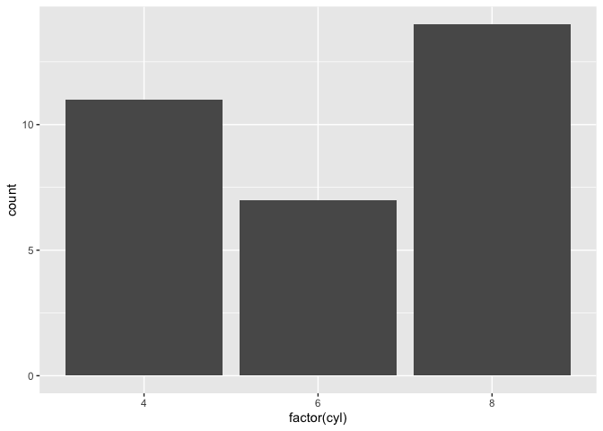

```r
getwd()
```

```
## [1] "/Users/isaiahbluestein/Desktop/BIS15W2021_ibluestein/lab1"
```


```r
#install.packages("tidyverse")
library("tidyverse")
```


```r
ggplot(mtcars, aes(x = factor(cyl))) +
    geom_bar()
```

<!-- -->

# Homework
## 2. R is an open source scripting language. Rstudio is a grapic user interface (GUI) that allows its users to interact with the program in a simpler, more visualy appealing and powerful way. GitHub is an online platform that allows coders to organize, store, and share their code. It is very useful to programers as it enables people to easily share and utilize code. 
## 4. 

```r
+ 5 - 3 * 2
```

```
## [1] -1
```

```r
+ 8 / 2 ** 2
```

```
## [1] 2
```
## 5. 

```r
+ (5 - 3) * 2
```

```
## [1] 4
```

```r
+ (8 / 2) ** 2
```

```
## [1] 16
```
## 6. 

```r
pi <- 3.14159265359 
```

## 7. 

```r
pi*2
```

```
## [1] 6.283185
```
## 8. 

```r
?mean
```

## 9. 

```r
x <- c(2, 8, 6, 6, 7, 4, 9, 9, 9, 10)
mean(x)
```

```
## [1] 7
```
## 10.

```r
median(x)
```

```
## [1] 7.5
```

