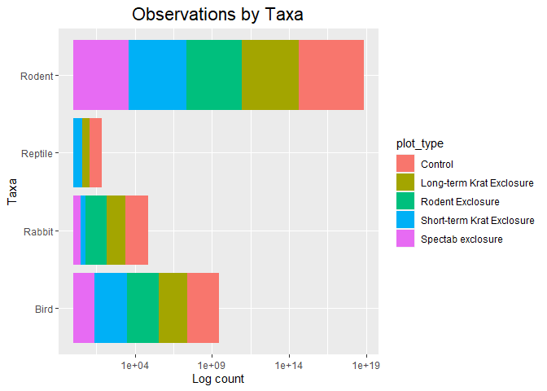
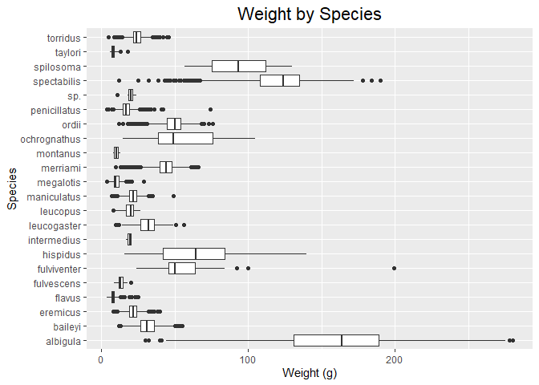
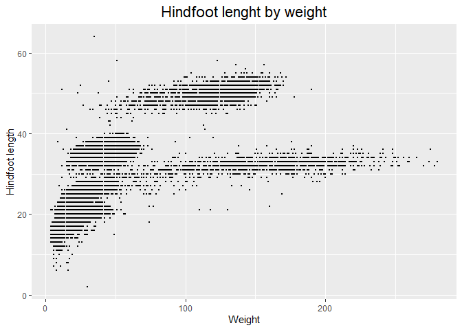
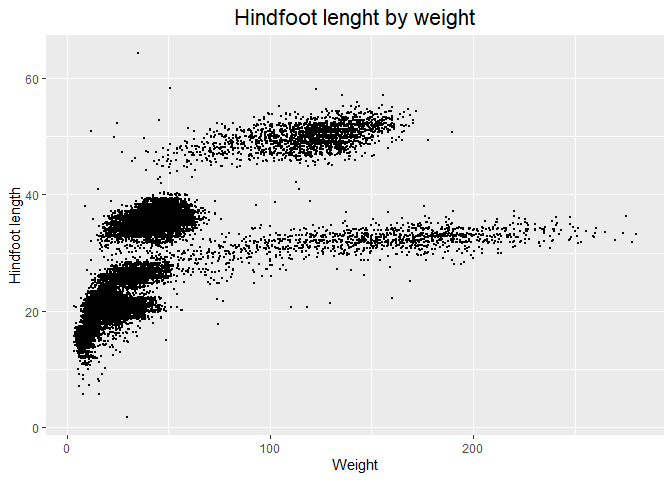
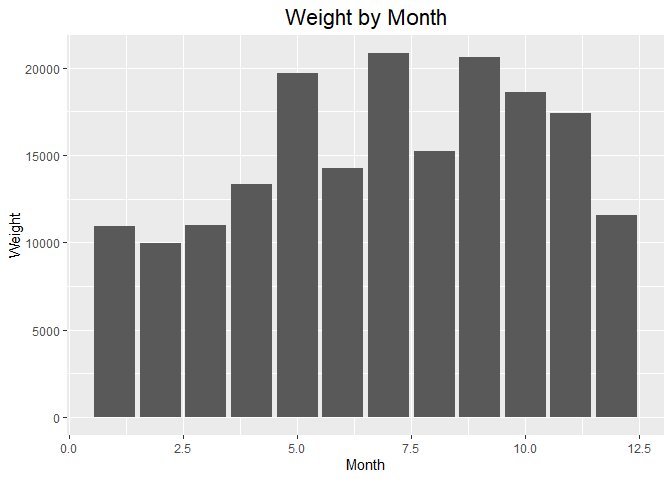

## Instructions
Answer the following questions and complete the exercises in RMarkdown. Please embed all of your code and push your final work to your repository. Your final lab report should be organized, clean, and run free from errors. Remember, you must remove the `#` for the included code chunks to run. Be sure to add your name to the author header above. For any included plots, make sure they are clearly labeled. You are free to use any plot type that you feel best communicates the results of your analysis.  

Make sure to use the formatting conventions of RMarkdown to make your report neat and clean!  

## Load the libraries

```r
library(tidyverse)
library(janitor)
library(here)
library(naniar)
```

## Desert Ecology
For this assignment, we are going to use a modified data set on [desert ecology](http://esapubs.org/archive/ecol/E090/118/). The data are from: S. K. Morgan Ernest, Thomas J. Valone, and James H. Brown. 2009. Long-term monitoring and experimental manipulation of a Chihuahuan Desert ecosystem near Portal, Arizona, USA. Ecology 90:1708.

```r
deserts <- read_csv(here("lab10", "data", "surveys_complete.csv"))
```

```
## 
## ── Column specification ────────────────────────────────────────────────────────
## cols(
##   record_id = col_double(),
##   month = col_double(),
##   day = col_double(),
##   year = col_double(),
##   plot_id = col_double(),
##   species_id = col_character(),
##   sex = col_character(),
##   hindfoot_length = col_double(),
##   weight = col_double(),
##   genus = col_character(),
##   species = col_character(),
##   taxa = col_character(),
##   plot_type = col_character()
## )
```

1. Use the function(s) of your choice to get an idea of its structure, including how NA's are treated. Are the data tidy?  

```r
glimpse(deserts)
```

```
## Rows: 34,786
## Columns: 13
## $ record_id       <dbl> 1, 2, 3, 4, 5, 6, 7, 8, 9, 10, 11, 12, 13, 14, 15, 16…
## $ month           <dbl> 7, 7, 7, 7, 7, 7, 7, 7, 7, 7, 7, 7, 7, 7, 7, 7, 7, 7,…
## $ day             <dbl> 16, 16, 16, 16, 16, 16, 16, 16, 16, 16, 16, 16, 16, 1…
## $ year            <dbl> 1977, 1977, 1977, 1977, 1977, 1977, 1977, 1977, 1977,…
## $ plot_id         <dbl> 2, 3, 2, 7, 3, 1, 2, 1, 1, 6, 5, 7, 3, 8, 6, 4, 3, 2,…
## $ species_id      <chr> "NL", "NL", "DM", "DM", "DM", "PF", "PE", "DM", "DM",…
## $ sex             <chr> "M", "M", "F", "M", "M", "M", "F", "M", "F", "F", "F"…
## $ hindfoot_length <dbl> 32, 33, 37, 36, 35, 14, NA, 37, 34, 20, 53, 38, 35, N…
## $ weight          <dbl> NA, NA, NA, NA, NA, NA, NA, NA, NA, NA, NA, NA, NA, N…
## $ genus           <chr> "Neotoma", "Neotoma", "Dipodomys", "Dipodomys", "Dipo…
## $ species         <chr> "albigula", "albigula", "merriami", "merriami", "merr…
## $ taxa            <chr> "Rodent", "Rodent", "Rodent", "Rodent", "Rodent", "Ro…
## $ plot_type       <chr> "Control", "Long-term Krat Exclosure", "Control", "Ro…
```

```r
summary(deserts)
```

```
##    record_id         month             day            year         plot_id     
##  Min.   :    1   Min.   : 1.000   Min.   : 1.0   Min.   :1977   Min.   : 1.00  
##  1st Qu.: 8964   1st Qu.: 4.000   1st Qu.: 9.0   1st Qu.:1984   1st Qu.: 5.00  
##  Median :17762   Median : 6.000   Median :16.0   Median :1990   Median :11.00  
##  Mean   :17804   Mean   : 6.474   Mean   :16.1   Mean   :1990   Mean   :11.34  
##  3rd Qu.:26655   3rd Qu.:10.000   3rd Qu.:23.0   3rd Qu.:1997   3rd Qu.:17.00  
##  Max.   :35548   Max.   :12.000   Max.   :31.0   Max.   :2002   Max.   :24.00  
##                                                                                
##   species_id            sex            hindfoot_length     weight      
##  Length:34786       Length:34786       Min.   : 2.00   Min.   :  4.00  
##  Class :character   Class :character   1st Qu.:21.00   1st Qu.: 20.00  
##  Mode  :character   Mode  :character   Median :32.00   Median : 37.00  
##                                        Mean   :29.29   Mean   : 42.67  
##                                        3rd Qu.:36.00   3rd Qu.: 48.00  
##                                        Max.   :70.00   Max.   :280.00  
##                                        NA's   :3348    NA's   :2503    
##     genus             species              taxa            plot_type        
##  Length:34786       Length:34786       Length:34786       Length:34786      
##  Class :character   Class :character   Class :character   Class :character  
##  Mode  :character   Mode  :character   Mode  :character   Mode  :character  
##                                                                             
##                                                                             
##                                                                             
## 
```

```r
#NAs are treated correctly and these data are tidy
```


2. How many genera and species are represented in the data? What are the total number of observations? Which species is most/ least frequently sampled in the study?

```r
deserts %>% 
  summarize(n_distinct(species_id), n_distinct(genus), n())
```

```
## # A tibble: 1 x 3
##   `n_distinct(species_id)` `n_distinct(genus)` `n()`
##                      <int>               <int> <int>
## 1                       48                  26 34786
```

```r
deserts %>% 
  count(species) %>% 
  arrange(n)
```

```
## # A tibble: 40 x 2
##    species          n
##    <chr>        <int>
##  1 clarki           1
##  2 scutalatus       1
##  3 tereticaudus     1
##  4 tigris           1
##  5 uniparens        1
##  6 viridis          1
##  7 leucophrys       2
##  8 savannarum       2
##  9 fuscus           5
## 10 undulatus        5
## # … with 30 more rows
```


#There are 26 genera and 40 species, and 34,786 observations in these data. Dipodomys merriami was the most frequestly sampled. The least frequenctly sampled is a tie between Sceloporus clarki, Crotalus scutalatus, Spermophilus tereticaudus, Cnemidophorus tigris, Cnemidophorus uniparens, and Crotalus viridis, which were each sampled only once. 

3. What is the proportion of taxa included in this study? Show a table and plot that reflects this count.

```r
deserts %>% 
  tabyl(taxa)
```

```
##     taxa     n      percent
##     Bird   450 0.0129362387
##   Rabbit    75 0.0021560398
##  Reptile    14 0.0004024608
##   Rodent 34247 0.9845052607
```

```r
names(deserts)
```

```
##  [1] "record_id"       "month"           "day"             "year"           
##  [5] "plot_id"         "species_id"      "sex"             "hindfoot_length"
##  [9] "weight"          "genus"           "species"         "taxa"           
## [13] "plot_type"
```


```r
deserts %>% 
  ggplot(aes(x = taxa))+
  coord_flip()+
  geom_bar()+
  scale_y_log10()+
  labs(title = "Observations by Taxa",
       x = "Taxa",
       y = "Log count") +
  theme(plot.title = element_text(size = rel(1.5), hjust = 0.5))
```

<!-- -->


4. For the taxa included in the study, use the fill option to show the proportion of individuals sampled by `plot_type.`

```r
deserts %>% 
  ggplot(aes(x = taxa, fill = plot_type))+
  coord_flip()+
  geom_bar()+
  scale_y_log10()+
  labs(title = "Observations by Taxa",
       x = "Taxa",
       y = "Log count") +
  theme(plot.title = element_text(size = rel(1.5), hjust = 0.5))
```

<!-- -->


5. What is the range of weight for each species included in the study? Remove any observations of weight that are NA so they do not show up in the plot.

```r
deserts %>% 
  filter(weight != "NA") %>% 
  group_by(species) %>% 
  summarise(max_weight = max(weight), min_weight = min(weight), mean_weight = mean(weight))
```

```
## # A tibble: 22 x 4
##    species     max_weight min_weight mean_weight
##  * <chr>            <dbl>      <dbl>       <dbl>
##  1 albigula           280         30      159.  
##  2 baileyi             55         12       31.7 
##  3 eremicus            40          8       21.6 
##  4 flavus              25          4        7.92
##  5 fulvescens          20          9       13.4 
##  6 fulviventer        199         24       58.9 
##  7 hispidus           140         16       65.6 
##  8 intermedius         21         17       19.2 
##  9 leucogaster         56         10       31.6 
## 10 leucopus            27          8       19.1 
## # … with 12 more rows
```


```r
deserts %>%
  filter(weight != "NA") %>%
  ggplot(aes(x = species, y = weight))+
  geom_boxplot()+
  coord_flip()+
  labs(title = "Weight by Species",
       x = "Species",
       y = "Weight (g)") +
  theme(plot.title = element_text(size = rel(1.5), hjust = 0.5))
```

<!-- -->


6. Add another layer to your answer from #4 using `geom_point` to get an idea of how many measurements were taken for each species.


```r
deserts %>%
  filter(weight != "NA") %>% 
  count(species) %>% 
  ggplot(aes(x = species, y = n))+
  coord_flip()+
  geom_point()+
  scale_y_log10()+
  labs(title = "Weight Weasurments by Species",
       x = "Species",
       y = "Log count") +
  theme(plot.title = element_text(size = rel(1.5), hjust = 0.5))
```

<!-- -->


7. [Dipodomys merriami](https://en.wikipedia.org/wiki/Merriam's_kangaroo_rat) is the most frequently sampled animal in the study. How have the number of observations of this species changed over the years included in the study?

```r
deserts %>% 
  filter(species == "merriami") %>% 
  group_by(year) %>% 
  summarize(n=n()) %>% 
  ggplot(aes(x = year, y = n))+
  geom_col()+
  labs(title = "Dipodomys merriami Measurments by Year",
       x = "Year",
       y = "n") +
  theme(plot.title = element_text(size = rel(1.5), hjust = 0.5))
```

<!-- -->

8. What is the relationship between `weight` and `hindfoot` length? Consider whether or not over plotting is an issue.

```r
deserts %>% 
  filter(weight!="NA") %>% 
  ggplot(aes(x=weight, y=hindfoot_length))+geom_point(size=.5)+
  labs(title = "Hindfoot lenght by weight",
       x = "Weight",
       y = "Hindfoot length") +
  theme(plot.title = element_text(size = rel(1.5), hjust = 0.5))
```

```
## Warning: Removed 1545 rows containing missing values (geom_point).
```

<!-- -->
#Points m,ight be on top of each other, so I'll try with jitter. 

```r
deserts %>% 
  filter(weight!="NA") %>% 
  ggplot(aes(x=weight, y=hindfoot_length))+geom_jitter(size=.5)+
  labs(title = "Hindfoot lenght by weight",
       x = "Weight",
       y = "Hindfoot length") +
  theme(plot.title = element_text(size = rel(1.5), hjust = 0.5))
```

```
## Warning: Removed 1545 rows containing missing values (geom_point).
```

<!-- -->


9. Which two species have, on average, the highest weight? Once you have identified them, make a new column that is a ratio of `weight` to `hindfoot_length`. Make a plot that shows the range of this new ratio and fill by sex.

```r
deserts %>% 
  group_by(species) %>% 
  summarise(average_weight = mean(weight, na.rm = T)) %>% 
  arrange(desc(average_weight))
```

```
## # A tibble: 40 x 2
##    species      average_weight
##    <chr>                 <dbl>
##  1 albigula              159. 
##  2 spectabilis           120. 
##  3 spilosoma              93.5
##  4 hispidus               65.6
##  5 fulviventer            58.9
##  6 ochrognathus           55.4
##  7 ordii                  48.9
##  8 merriami               43.2
##  9 baileyi                31.7
## 10 leucogaster            31.6
## # … with 30 more rows
```
#Albigula and spectabilis have the highest mean weight. 

10. Make one plot of your choice! Make sure to include at least two of the aesthetics options you have learned.

```r
names(deserts)
```

```
##  [1] "record_id"       "month"           "day"             "year"           
##  [5] "plot_id"         "species_id"      "sex"             "hindfoot_length"
##  [9] "weight"          "genus"           "species"         "taxa"           
## [13] "plot_type"
```

```r
#how does weight vary by month for Neotoma albigula? 
deserts %>% 
  filter(species == "albigula") %>% 
  filter(weight != "NA") %>%
  ggplot(aes(x = month, y = weight))+
  geom_col()+
   labs(title = "Weight by Month",
       x = "Month",
       y = "Weight") +
  theme(plot.title = element_text(size = rel(1.5), hjust = 0.5))
```

<!-- -->

## Push your final code to GitHub!
Please be sure that you check the `keep md` file in the knit preferences. 
