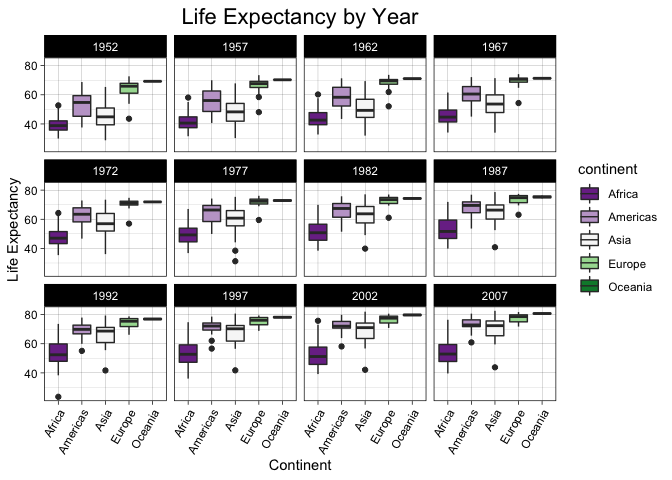
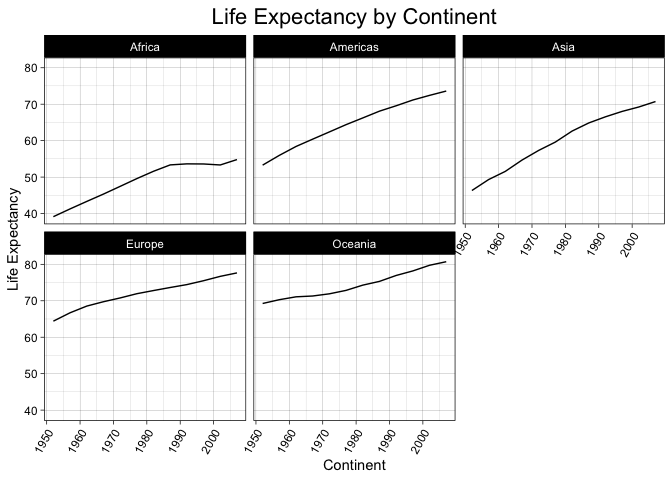
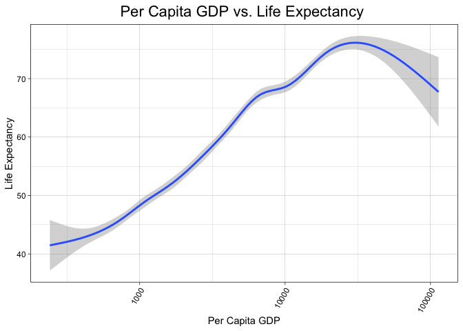
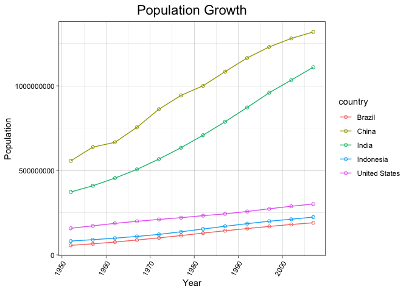
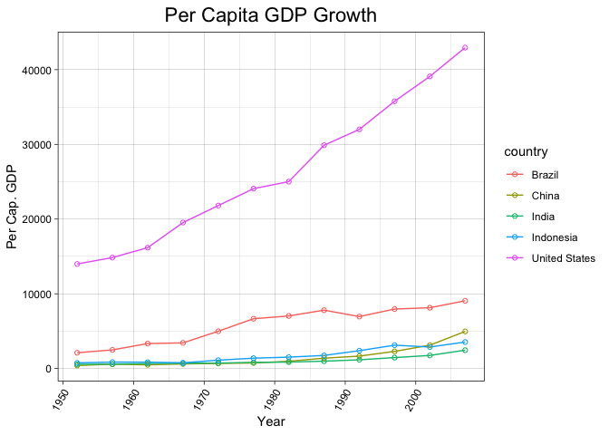
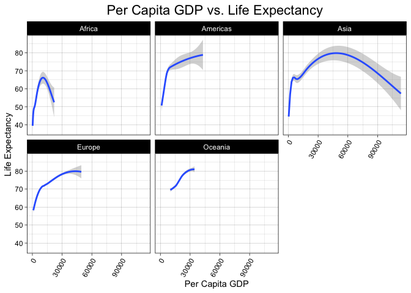

## Instructions
Answer the following questions and complete the exercises in RMarkdown. Please embed all of your code and push your final work to your repository. Your final lab report should be organized, clean, and run free from errors. Remember, you must remove the `#` for the included code chunks to run. Be sure to add your name to the author header above. For any included plots, make sure they are clearly labeled. You are free to use any plot type that you feel best communicates the results of your analysis.  

**In this homework, you should make use of the aesthetics you have learned. It's OK to be flashy!**

Make sure to use the formatting conventions of RMarkdown to make your report neat and clean!  

## Load the libraries

```r
library(tidyverse)
library(janitor)
library(here)
library(RColorBrewer)
library(naniar)
library(ggthemes)
```


```r
options(scipen=999)
```

## Resources
The idea for this assignment came from [Rebecca Barter's](http://www.rebeccabarter.com/blog/2017-11-17-ggplot2_tutorial/) ggplot tutorial so if you get stuck this is a good place to have a look.  

## Gapminder
For this assignment, we are going to use the dataset [gapminder](https://cran.r-project.org/web/packages/gapminder/index.html). Gapminder includes information about economics, population, and life expectancy from countries all over the world. You will need to install it before use. This is the same data that we will use for midterm 2 so this is good practice.

```r
#install.packages("gapminder")
library("gapminder")
```

## Questions
The questions below are open-ended and have many possible solutions. Your approach should, where appropriate, include numerical summaries and visuals. Be creative; assume you are building an analysis that you would ultimately present to an audience of stakeholders. Feel free to try out different `geoms` if they more clearly present your results.  

**1. Use the function(s) of your choice to get an idea of the overall structure of the data frame, including its dimensions, column names, variable classes, etc. As part of this, determine how NA's are treated in the data.**  


```r
glimpse(gapminder)
```

```
## Rows: 1,704
## Columns: 6
## $ country   <fct> Afghanistan, Afghanistan, Afghanistan, Afghanistan, Afghani…
## $ continent <fct> Asia, Asia, Asia, Asia, Asia, Asia, Asia, Asia, Asia, Asia,…
## $ year      <int> 1952, 1957, 1962, 1967, 1972, 1977, 1982, 1987, 1992, 1997,…
## $ lifeExp   <dbl> 28.801, 30.332, 31.997, 34.020, 36.088, 38.438, 39.854, 40.…
## $ pop       <int> 8425333, 9240934, 10267083, 11537966, 13079460, 14880372, 1…
## $ gdpPercap <dbl> 779.4453, 820.8530, 853.1007, 836.1971, 739.9811, 786.1134,…
```

```r
gapminder
```

```
## # A tibble: 1,704 x 6
##    country     continent  year lifeExp      pop gdpPercap
##    <fct>       <fct>     <int>   <dbl>    <int>     <dbl>
##  1 Afghanistan Asia       1952    28.8  8425333      779.
##  2 Afghanistan Asia       1957    30.3  9240934      821.
##  3 Afghanistan Asia       1962    32.0 10267083      853.
##  4 Afghanistan Asia       1967    34.0 11537966      836.
##  5 Afghanistan Asia       1972    36.1 13079460      740.
##  6 Afghanistan Asia       1977    38.4 14880372      786.
##  7 Afghanistan Asia       1982    39.9 12881816      978.
##  8 Afghanistan Asia       1987    40.8 13867957      852.
##  9 Afghanistan Asia       1992    41.7 16317921      649.
## 10 Afghanistan Asia       1997    41.8 22227415      635.
## # … with 1,694 more rows
```


```r
summary(gapminder)
```

```
##         country        continent        year         lifeExp     
##  Afghanistan:  12   Africa  :624   Min.   :1952   Min.   :23.60  
##  Albania    :  12   Americas:300   1st Qu.:1966   1st Qu.:48.20  
##  Algeria    :  12   Asia    :396   Median :1980   Median :60.71  
##  Angola     :  12   Europe  :360   Mean   :1980   Mean   :59.47  
##  Argentina  :  12   Oceania : 24   3rd Qu.:1993   3rd Qu.:70.85  
##  Australia  :  12                  Max.   :2007   Max.   :82.60  
##  (Other)    :1632                                                
##       pop               gdpPercap       
##  Min.   :     60011   Min.   :   241.2  
##  1st Qu.:   2793664   1st Qu.:  1202.1  
##  Median :   7023596   Median :  3531.8  
##  Mean   :  29601212   Mean   :  7215.3  
##  3rd Qu.:  19585222   3rd Qu.:  9325.5  
##  Max.   :1318683096   Max.   :113523.1  
## 
```


```r
naniar::miss_var_summary(gapminder)
```

```
## # A tibble: 6 x 3
##   variable  n_miss pct_miss
##   <chr>      <int>    <dbl>
## 1 country        0        0
## 2 continent      0        0
## 3 year           0        0
## 4 lifeExp        0        0
## 5 pop            0        0
## 6 gdpPercap      0        0
```

 
**2. Among the interesting variables in gapminder is life expectancy. How has global life expectancy changed between 1952 and 2007?**

```r
names(gapminder)
```

```
## [1] "country"   "continent" "year"      "lifeExp"   "pop"       "gdpPercap"
```


```r
gapminder %>%
  group_by(year) %>% 
  summarise(mean_life = mean(lifeExp), max_life = max(lifeExp), min_life = min(lifeExp))
```

```
## # A tibble: 12 x 4
##     year mean_life max_life min_life
##  * <int>     <dbl>    <dbl>    <dbl>
##  1  1952      49.1     72.7     28.8
##  2  1957      51.5     73.5     30.3
##  3  1962      53.6     73.7     32.0
##  4  1967      55.7     74.2     34.0
##  5  1972      57.6     74.7     35.4
##  6  1977      59.6     76.1     31.2
##  7  1982      61.5     77.1     38.4
##  8  1987      63.2     78.7     39.9
##  9  1992      64.2     79.4     23.6
## 10  1997      65.0     80.7     36.1
## 11  2002      65.7     82       39.2
## 12  2007      67.0     82.6     39.6
```

```r
gapminder %>%
  group_by(year) %>%
  summarise(mean_life = mean(lifeExp)) %>% 
  ggplot(aes(x = year, y = mean_life, group = mean_life))+
  geom_line(aes(group = 1))+
  labs(title = "Average Life Expectancy",
       x = "Year",
       y= "Life Expectancy")+
    theme_linedraw()+
  theme(axis.text.x = element_text(angle = 60, hjust = 1), plot.title = element_text(size = rel(1.5), hjust = 0.5))
```

<!-- -->


**3. How do the distributions of life expectancy compare for the years 1952 and 2007?**

```r
gapminder %>% #This looks correct in Rmd, but when I knit it, it only shows one of the box plots! I can't figure out why!
  filter(year == 1952 | year == 2007) %>% 
  group_by(year) %>% 
  ggplot(aes(x = year, y = lifeExp, fill = year))+
  geom_boxplot()+
    scale_fill_brewer(palette = "PRGn")+
  labs(title = "Life Expectancy",
       x = "Year",
       y= "Life Expectancy")+
    theme_linedraw()+
  theme(axis.text.x = element_text(angle = 60, hjust = 1), plot.title = element_text(size = rel(1.5), hjust = 0.5))
```

```
## Warning: Continuous x aesthetic -- did you forget aes(group=...)?
```

<!-- -->


**4. Your answer above doesn't tell the whole story since life expectancy varies by region. Make a summary that shows the min, mean, and max life expectancy by continent for all years represented in the data.**

```r
gapminder %>% 
  group_by(year, continent) %>% 
  summarize(max_life = max(lifeExp), min_life = min(lifeExp), mean_life = mean(lifeExp))
```

```
## `summarise()` has grouped output by 'year'. You can override using the `.groups` argument.
```

```
## # A tibble: 60 x 5
## # Groups:   year [12]
##     year continent max_life min_life mean_life
##    <int> <fct>        <dbl>    <dbl>     <dbl>
##  1  1952 Africa        52.7     30        39.1
##  2  1952 Americas      68.8     37.6      53.3
##  3  1952 Asia          65.4     28.8      46.3
##  4  1952 Europe        72.7     43.6      64.4
##  5  1952 Oceania       69.4     69.1      69.3
##  6  1957 Africa        58.1     31.6      41.3
##  7  1957 Americas      70.0     40.7      56.0
##  8  1957 Asia          67.8     30.3      49.3
##  9  1957 Europe        73.5     48.1      66.7
## 10  1957 Oceania       70.3     70.3      70.3
## # … with 50 more rows
```

```r
gapminder %>% 
  ggplot(aes(x = continent, y = lifeExp, fill = continent))+
  geom_boxplot()+
  facet_wrap(~year)+
  scale_fill_brewer(palette = "PRGn")+
  labs(title = "Life Expectancy by Year",
       x = "Continent",
       y= "Life Expectancy")+
    theme_linedraw()+
  theme(axis.text.x = element_text(angle = 60, hjust = 1), plot.title = element_text(size = rel(1.5), hjust = 0.5))
```

<!-- -->


**5. How has life expectancy changed between 1952-2007 for each continent?**

```r
gapminder %>%
  group_by(year, continent) %>%
  summarise(mean_life = mean(lifeExp)) %>% 
  ggplot(aes(x = year, y = mean_life))+
  geom_line(aes(group = 1))+
facet_wrap(~continent)+
  scale_fill_brewer(palette = "PRGn")+
  labs(title = "Life Expectancy by Continent",
       x = "Continent",
       y= "Life Expectancy")+
    theme_linedraw()+
  theme(axis.text.x = element_text(angle = 60, hjust = 1), plot.title = element_text(size = rel(1.5), hjust = 0.5))
```

```
## `summarise()` has grouped output by 'year'. You can override using the `.groups` argument.
```

<!-- -->


**6. We are interested in the relationship between per capita GDP and life expectancy; i.e. does having more money help you live longer?**

```r
names(gapminder)
```

```
## [1] "country"   "continent" "year"      "lifeExp"   "pop"       "gdpPercap"
```


```r
gapminder %>% 
  ggplot(aes(x=gdpPercap, y=lifeExp))+
  geom_smooth()+
    scale_x_log10()+
  labs(title = "Per Capita GDP vs. Life Expectancy ",
       x = "Per Capita GDP",
       y= "Life Expectancy")+
    theme_linedraw()+
  theme(axis.text.x = element_text(angle = 60, hjust = 1), plot.title = element_text(size = rel(1.5), hjust = 0.5))
```

```
## `geom_smooth()` using method = 'gam' and formula 'y ~ s(x, bs = "cs")'
```

<!-- -->

**7. Which countries have had the largest population growth since 1952?**

```r
gapminder_2 <- gapminder %>% 
  select(year, country, pop) %>% 
  filter(year == "1952" | year == "2007") %>% 
  pivot_wider(names_from = year, values_from = "pop" ) %>% 
  rename(initial_pop = "1952", final_pop = "2007")
gapminder_2
```

```
## # A tibble: 142 x 3
##    country     initial_pop final_pop
##    <fct>             <int>     <int>
##  1 Afghanistan     8425333  31889923
##  2 Albania         1282697   3600523
##  3 Algeria         9279525  33333216
##  4 Angola          4232095  12420476
##  5 Argentina      17876956  40301927
##  6 Australia       8691212  20434176
##  7 Austria         6927772   8199783
##  8 Bahrain          120447    708573
##  9 Bangladesh     46886859 150448339
## 10 Belgium         8730405  10392226
## # … with 132 more rows
```


```r
growth <- gapminder_2 %>% 
  mutate(pop_growth = final_pop - initial_pop) %>% 
  arrange(desc(pop_growth))
growth
```

```
## # A tibble: 142 x 4
##    country       initial_pop  final_pop pop_growth
##    <fct>               <int>      <int>      <int>
##  1 China           556263527 1318683096  762419569
##  2 India           372000000 1110396331  738396331
##  3 United States   157553000  301139947  143586947
##  4 Indonesia        82052000  223547000  141495000
##  5 Brazil           56602560  190010647  133408087
##  6 Pakistan         41346560  169270617  127924057
##  7 Bangladesh       46886859  150448339  103561480
##  8 Nigeria          33119096  135031164  101912068
##  9 Mexico           30144317  108700891   78556574
## 10 Philippines      22438691   91077287   68638596
## # … with 132 more rows
```


**8. Use your results from the question above to plot population growth for the top five countries since 1952.**

```r
growth %>% 
  top_n(5, pop_growth)
```

```
## # A tibble: 5 x 4
##   country       initial_pop  final_pop pop_growth
##   <fct>               <int>      <int>      <int>
## 1 China           556263527 1318683096  762419569
## 2 India           372000000 1110396331  738396331
## 3 United States   157553000  301139947  143586947
## 4 Indonesia        82052000  223547000  141495000
## 5 Brazil           56602560  190010647  133408087
```


```r
gapminder %>% 
  filter(country == "China" | country == "India" | country == "United States" | country == "Indonesia" | country == "Brazil") %>%
  group_by(country) %>% 
  ggplot(aes(x=year, y=pop, group=country, color=country))+
  geom_line()+
  geom_point(shape=1)+
 labs(title = "Population Growth",
       x = "Year",
       y= "Population")+
    theme_linedraw()+
  theme(axis.text.x = element_text(angle = 60, hjust = 1), plot.title = element_text(size = rel(1.5), hjust = 0.5))
```

<!-- -->


**9. How does per-capita GDP growth compare between these same five countries?**

```r
gapminder %>% 
  filter(country == "China" | country == "India" | country == "United States" | country == "Indonesia" | country == "Brazil") %>%
  group_by(country) %>% 
  ggplot(aes(x=year, y=gdpPercap, group=country, color=country))+
  geom_line()+
  geom_point(shape=1)+
 labs(title = "Per Capita GDP Growth",
       x = "Year",
       y= "Per Cap. GDP")+
    theme_linedraw()+
  theme(axis.text.x = element_text(angle = 60, hjust = 1), plot.title = element_text(size = rel(1.5), hjust = 0.5))
```

<!-- -->


**10. Make one plot of your choice that uses faceting!**

```r
names(gapminder)
```

```
## [1] "country"   "continent" "year"      "lifeExp"   "pop"       "gdpPercap"
```


```r
#How does the relationship between GDP and Life expectancy vary by continent?
gapminder %>% 
  ggplot(aes(x=gdpPercap, y=lifeExp))+
  geom_smooth()+
facet_wrap(~continent)+
  labs(title = "Per Capita GDP vs. Life Expectancy ",
       x = "Per Capita GDP",
       y= "Life Expectancy")+
    theme_linedraw()+
  theme(axis.text.x = element_text(angle = 60, hjust = 1), plot.title = element_text(size = rel(1.5), hjust = 0.5))
```

```
## `geom_smooth()` using method = 'loess' and formula 'y ~ x'
```

<!-- -->


## Push your final code to GitHub!
Please be sure that you check the `keep md` file in the knit preferences. 
